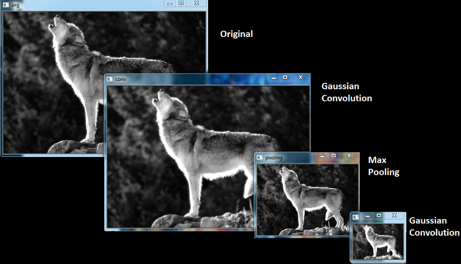

# Convolution-Pooling-Dropout
<h1>Manual pure code of Convolution-Pooling-Dropout</h1>
COnvolution Pooling are most famuse and important function in Deeplearning in Image processing as noise and dimentional reduction. The manual code wroted by me, and it is open source to use, it can changed the architecture of Convoltion Pooling and dropout. 
<h2>prerequisite</h2>
- numpy
- cv2
- skimage

insert image in jpg and run.

<h3>Output result</h3>
